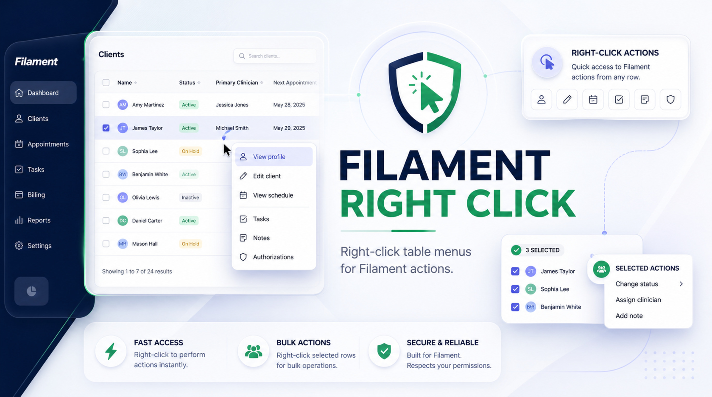
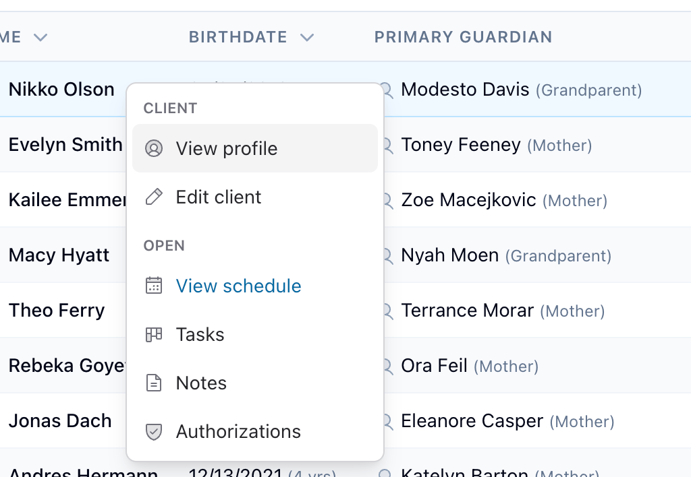

# Filament Right Click

<p align="center">
    
</p>

Right-click table row menus for Filament panels.

This package adds a static right-click menu to Filament table records. Menu items trigger native Filament table actions, so action modals, confirmation, authorization, validation, notifications, redirects, and server-side disabled/hidden checks remain owned by Filament.

## Installation

```bash
composer require leek/filament-right-click
php artisan filament:assets
```

Register the plugin on the panels that should support right-click menus:

```php
use Leek\FilamentRightClick\FilamentRightClickPlugin;

$panel
    ->plugin(FilamentRightClickPlugin::make());
```

## Usage

Use `contextMenuActions()` for single-record row menu items and `contextMenuBulkActions()` for selected-record menu items:

```php
use Filament\Actions\Action;
use Filament\Actions\BulkAction;
use Filament\Actions\DeleteAction;
use Filament\Support\Icons\Heroicon;
use Filament\Tables\Table;
use Leek\FilamentRightClick\Menu\ContextMenuItem;
use Leek\FilamentRightClick\Menu\ContextMenuSection;
use Leek\FilamentRightClick\Menu\ContextMenuSeparator;

public static function table(Table $table): Table
{
    return $table
        ->columns([
            // ...
        ])
        ->contextMenuActions([
            ContextMenuSection::make([
                ContextMenuItem::for(
                    Action::make('archive')
                        ->requiresConfirmation()
                        ->action(fn ($record) => $record->archive()),
                )
                    ->label('Archive')
                    ->icon(Heroicon::ArchiveBox)
                    ->color('warning'),
            ])->label('Manage'),

            ContextMenuSeparator::make(),

            ContextMenuItem::for(DeleteAction::make())
                ->label('Delete')
                ->icon(Heroicon::Trash)
                ->color('danger'),
        ])
        ->contextMenuBulkActions([
            ContextMenuItem::forBulkAction(
                BulkAction::make('archiveSelected')
                    ->label('Archive Selected')
                    ->requiresConfirmation()
                    ->action(fn ($records) => $records->each->archive()),
            )
                ->icon(Heroicon::ArchiveBox)
                ->color('warning'),
        ]);
}
```

The wrapped actions are registered as table actions, but they are not rendered in the normal row action column. On click, the package calls Filament's table action mounting path for the row record key.

Bulk actions are registered as table bulk actions without rendering in the normal bulk action dropdown. When the right-clicked row is already selected, the bulk menu uses the current Filament selection, including select-all-across-pages state. When the right-clicked row is not selected, the single-record menu opens instead.

## Screenshot

<p align="center">
    
</p>

## Behavior

- Right-click opens the menu anywhere on a table row except existing interactive controls.
- The browser context menu is only suppressed for rows in tables with configured right-click actions.
- `ContextMenu` keyboard key and `Shift+F10` open the menu for the focused or last-hovered row.
- `Escape` closes the menu, arrow keys move through items, and `Enter` / `Space` trigger the focused item.
- Touch and long-press gestures are intentionally not included in v1.

## Static menu, server-enforced actions

The menu label, icon, and color are static metadata on `ContextMenuItem`. The underlying Filament action still decides whether the operation can run for the specific record.

If a right-click item points to an action that is hidden, disabled, or unauthorized for a row, Filament will refuse to mount it. The menu closes and no client-side policy decision is made.

## Asset loading

Assets are registered as `loadedOnRequest()` and are requested only by tables that use `contextMenuActions()` or `contextMenuBulkActions()`.

If you publish or bundle assets in your own build pipeline, keep the DOM contract intact:

- table root record menu: `data-filament-right-click-record-config`
- table root bulk menu: `data-filament-right-click-bulk-config`
- legacy table root record menu: `data-filament-right-click-config`
- row key source: Filament's native row `wire:key`
- record action call: `mountTableAction(actionName, recordKey)`
- bulk action call: synchronize Filament's selected table record properties, then mount the bulk action

## Bulk actions

Use `contextMenuBulkActions()` with `ContextMenuItem::forBulkAction()` or pass a `BulkAction` directly:

```php
use Filament\Actions\BulkAction;
use Leek\FilamentRightClick\Menu\ContextMenuItem;

$table->contextMenuBulkActions([
    ContextMenuItem::forBulkAction(
        BulkAction::make('deleteSelected')
            ->label('Delete Selected')
            ->requiresConfirmation()
            ->action(fn ($records) => $records->each->delete()),
    )
        ->color('danger'),
]);
```

Bulk actions are still server-enforced by Filament. Hidden, disabled, and unauthorized actions will not mount.

## Compatibility

This package targets Filament v4 and v5.

Record actions use Filament's table action mounting path. Bulk actions use the newer unified `mountAction()` path when available and fall back to Filament's table bulk action compatibility method.
